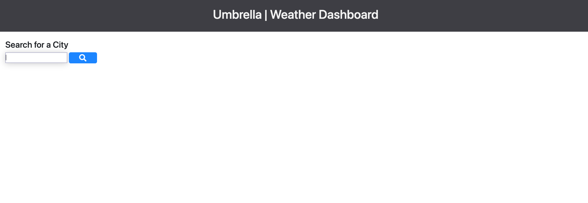
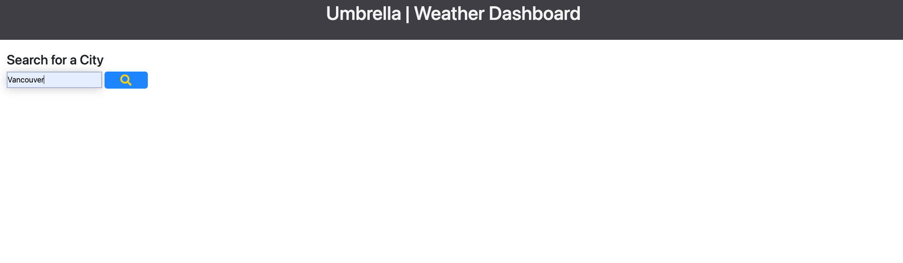
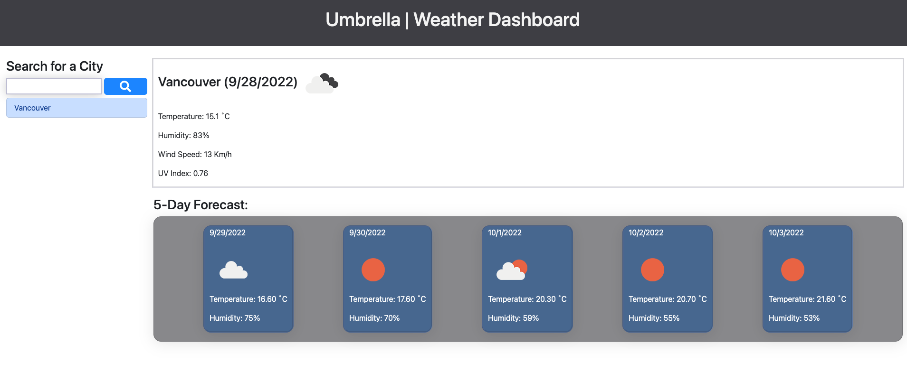
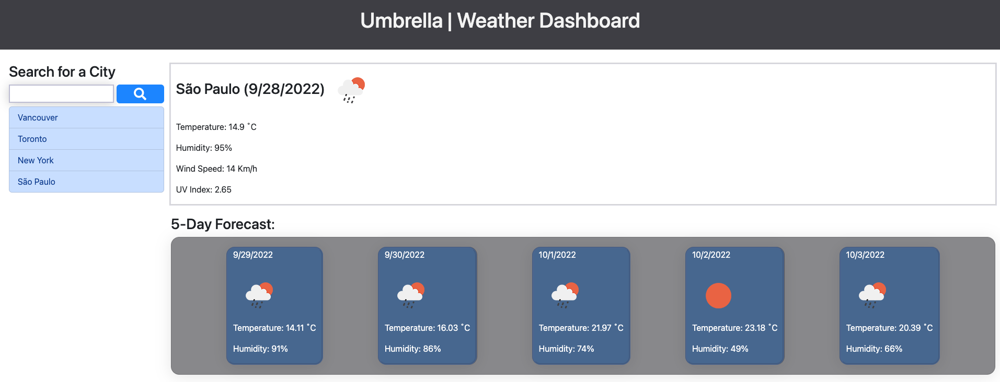

# Umbrella | Weather Dashboard

## Description
Considering that a user wants to consult the weather forecast for multiple destinations. The following parameters were implemented:
 - AS A traveler
 - I WANT to see the weather outlook for multiple cities
 - SO THAT I can plan a trip accordingly
    - GIVEN a weather dashboard with form inputs
    - WHEN I search for a city
    - THEN I am presented with current and future conditions for that city and that city is added to the search history
    - WHEN I view current weather conditions for that city
    - THEN I am presented with the city name, the date, an icon representation of weather conditions, the temperature, the humidity, and the wind speed
    - WHEN I view future weather conditions for that city
    - THEN I am presented with a 5-day forecast that displays the date, an icon representation of weather conditions, the temperature, the wind speed, and the humidity
    - WHEN I click on a city in the search history
    - THEN I am again presented with current and future conditions for that city
## Table of Contents
- [Description](#description)
- [Usage](#usage)
- [Demo](#demo)
- [License](#license)
- [Contributing](#contributing)
- [Feedback](#feedback)

## Usage
To run and test this application, simply access the deployment [URL](https://rfabreu.github.io/weather/) and follow the instructions listed on the [user story](#description).

 - [Click to run the App!](https://rfabreu.github.io/weather/)

 

## Demo
### View the following screen shots of the app:

 

 

 

## License
This project is licensed under the MIT License.
## Contributing
If you are interested in contributing to the project you can `fork` the repository and submit a `pull request` or contact me via [email](mailto:rafael.gomes@mail.utoronto.ca).

## Feedback
GitHub: [github.com/rfabreu](https://github.com/rfabreu)  
Comments, suggestions, questions? Contact me at: [rafael.gomes@mail.utoronto.ca](mailto:rafael.gomes@mail.utoronto.ca)  
Link to deployed application: [Use the Weather App!](https://rfabreu.github.io/weather/)